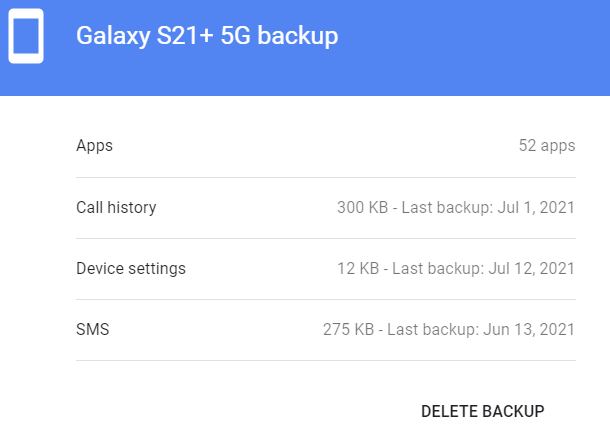

# 안드로이드 앱에서 구글 계정으로 동기화된 데이터는 어디에 저장될까? 

수동으로 URL을 쳐서 들어갈 수 있으며, 여러개의 구글계정이 있다면 URL 속의 숫자를 바꿔가며 확인하면 된다. 

즉, 아래에서는 0번 계정의 `backup`을 보는 것이다. 그렇다고 해도 암호화 되어 있어서 내용을 볼 수는 없다.

`https://dirve.google.com/drive/u/0/backups`

